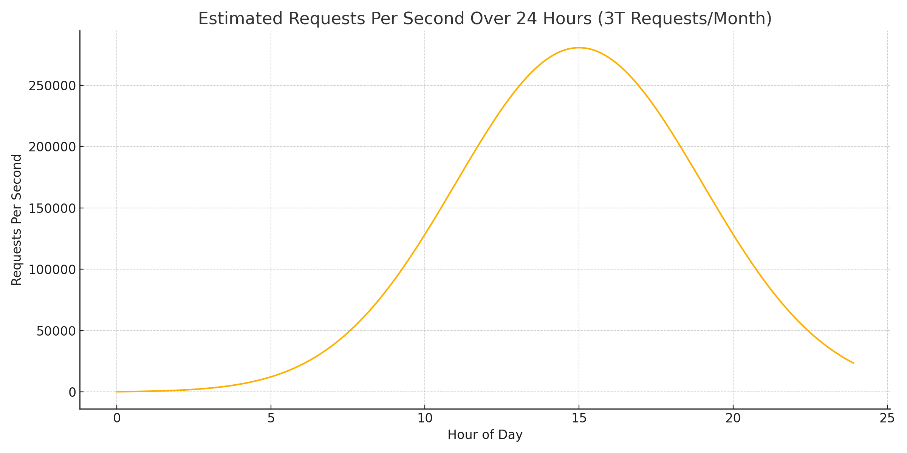

# Request Rate Analysis for 3 Trillion Requests per Month

## Overview

This document calculates the average and estimated peak requests per second (RPS) for a system handling **3 trillion requests per month**, assuming a normal distribution of traffic over a 24-hour day.

---

## Calculations

**Total requests per month**: 3,000,000,000,000  
**Seconds in a 30-day month**: 30 × 24 × 60 × 60 = 2,592,000  

### Average RPS:
\[
\text{Average RPS} = \frac{3,000,000,000,000}{2,592,000} \approx \mathbf{1,157,407}
\]

### Estimated Peak RPS:
Assuming a normal distribution (single peak during the day):
\[
\text{Peak RPS} \approx 3 \times \text{Average RPS} = 3 \times 1,157,407 = \mathbf{3,472,222}
\]

---

## Traffic Pattern Visualization

Below is a graph showing the estimated **requests per second** over a 24-hour day, modeled as a normal distribution peaking at 3 PM (15:00) with a standard deviation of 4 hours.

